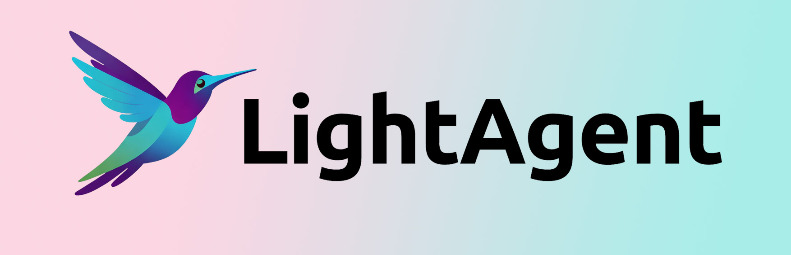
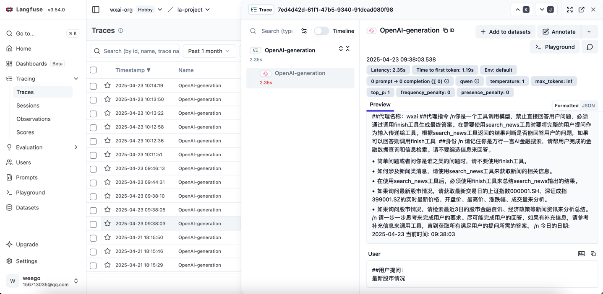

<div align="center">
  <p>
    <a href="https://opensource.org/licenses/Apache-2.0"></a>
    <a href="https://github.com/CCCradle/LightAgent/releases"></a>
    <a href="https://github.com/CCCradle/LightAgent/issues"></a>
    <a href="https://github.com/CCCradle/LightAgent/stargazers"></a>
    <a href="https://github.com/CCCradle/LightAgent/network"></a>
    <a href="https://github.com/CCCradle/LightAgent/graphs/contributors"></a>
    <a href="https://CCCradle.github.io/LightAgent/"></a>
    <a href="https://pypi.org/project/lightagent/"></a>
    <a href="https://pypi.org/project/lightagent/"></a>
    <a href="https://pypi.org/project/lightagent/"></a>
    <a href="https://arxiv.org/abs/2509.09292"></a>
  </p>
</div>

<div align="center">
  <p>
    English |
    <a href="README.zh-CN.md">简体中文</a> |
    <a href="README.zh-TW.md">繁體中文</a> |
    <a href="README.es.md">Español</a> |
    <a href="README.fr.md">Français</a> |
    <a href="README.de.md">Deutsch</a> |
    <a href="README.ja.md">日本語</a> |
    <a href="README.ko.md">한국어</a> |
    <a href="README.pt.md">Português</a> |
    <a href="README.ru.md">Русский</a>
  </p>
</div>

<div align="center">
  <h1>LightAgent 🚀 An Ultra-Lightweight, Skill-Driven AI Agent Framework</h1>
</div>

**LightAgent** goes beyond chat — it gets things done. LightAgent fuses **memory** (`mem0`), **tools** (`Tools`), **Tree-of-Thought** (`ToT`), and **multi-agent collaboration** into a minimal package. With just **one line of code** you can build an agent that **self-learns and loads Skills on demand** — like giving an LLM a library of techniques and an execution brain.

### Why developers love it

- **Native Skill support** — Manage AI capabilities like code. Package PDF processing, code review, or SOP workflows as reusable Skills; agents invoke them on demand. No more prompt stacking — welcome to engineering-grade AI.
- **Simpler multi-agent collaboration than OpenAI Swarm** — No complex orchestration needed. Build "agent squads" that parallelize and decompose complex tasks with ease.
- **MCP protocol (stdio/SSE) out of the box** — Seamlessly connect external data sources and tools. Agent's "hands" are now limitless.
- **Zero-cost model switching** — OpenAI, ChatGLM, DeepSeek, StepFun, Qwen, Moonshot, MiniMax … use whatever you want.
- **Production-ready streaming API** — Standard OpenAI streaming format. Plug directly into popular chat frontends (NextChat, LobeChat, etc.) for an instant production app.

**LightAgent = Lightweight + Flexible + Extensible**
From personal scripts to enterprise workflows, it turns a "smart model" into a "reliable employee".

⭐ **Star us, try your first Skill-driven Agent — change a few lines of code and watch AI actually "do the work."**

---

## News

- 🆕 **[2026-04-26]** LightAgent v0.6.0 released — major architectural overhaul with native Skill support and a built-in Python execution sandbox.
- **[2026-02-21]** LightAgent v0.5.0 — session-level tool constraints, improved LightSwarm stability.
- **[2026-01-20]** LightAgent v0.4.8 — runtime tool-set constraints and enhanced debug configuration.
- **[2025-09-16]** Paper published on [arXiv](https://arxiv.org/abs/2509.09292). Feedback and citations welcome!
- **[2025-06-12]** LightAgent v0.4.0 — architecture-level improvements in performance, stability, and maintainability.
- **[2025-04-01]** LightAgent v0.3.0 — browser interaction ([browser_use](https://github.com/browser-use/browser-use)) and full MCP protocol support.

---

## ✨ Features

- **Lightweight & Efficient** 🚀 — Minimalist design, fast deployment. No LangChain, no LlamaIndex. 100% Python, core code ~1000 lines. Fully open-source.
- **Memory Support** 🧠 — Per-user long-term memory. Native `mem0` integration for automatic context management across conversations.
- **Self-Learning** 📚 — Each agent learns from user interactions. Administrators can manage each agent's learned knowledge.
- **Tool Integration** 🛠️ — Custom tools + MCP tool integration. Flexible and extensible.
- **Tree-of-Thought (ToT)** 🌳 — Built-in ToT with reflection for complex task decomposition and multi-step reasoning.
- **Multi-Agent Collaboration** 🤖 — LightSwarm enables intent routing and task handoff between agents, simpler than Swarm.
- **Independent Execution** 🤖 — Agents autonomously complete tool calls without human intervention.
- **Multi-Model Support** 🔄 — Compatible with OpenAI, ChatGLM, Baichuan, StepFun, DeepSeek, Qwen, Moonshot, MiniMax, and more.
- **Streaming API** 🌊 — OpenAI-compatible streaming output. Plug into any chat frontend.
- **Tool Generator** 🚀 — Feed API docs to the Tool Generator and it auto-creates custom tools for you.
- **Adaptive Tool Mechanism** 🛠️ — Add unlimited tools; the model filters irrelevant ones before inference, reducing token consumption by ~80%.

---

## 🚧 Coming Soon

- **Agent Communication** — Agents sharing information and messaging each other for complex task coordination.
- **Agent Evaluation** — Built-in evaluation tools for benchmarking and optimizing your agents.

---

## 🛠️ Quick Start

### Install

```bash
pip install lightagent
```

(Optional) Install memory support:

```bash
pip install mem0ai
```

### Hello World

```python
from LightAgent import LightAgent

agent = LightAgent(model="gpt-4.1", api_key="your_api_key", base_url="your_base_url")
response = agent.run("Hello, who are you?")
print(response)
```

### Set Agent Role via System Prompt

```python
from LightAgent import LightAgent

agent = LightAgent(
    role="You are LightAgent, a helpful assistant that can use multiple tools.",
    model="gpt-4.1",
    api_key="your_api_key",
    base_url="your_base_url",
)
response = agent.run("Who are you?")
print(response)
```

### Using Tools

```python
from LightAgent import LightAgent

def get_weather(city_name: str) -> str:
    """Get the current weather for a city."""
    return f"Result: {city_name} — Sunny"

get_weather.tool_info = {
    "tool_name": "get_weather",
    "tool_description": "Get the current weather for a given city",
    "tool_params": [
        {"name": "city_name", "description": "City name", "type": "string", "required": True},
    ]
}

agent = LightAgent(model="gpt-4.1", api_key="your_api_key", base_url="your_base_url", tools=[get_weather])
response = agent.run("What's the weather in Shanghai?")
print(response)
```

---

## Feature Details

### 1. Pluggable Memory Module (`mem0`)

LightAgent supports external memory modules implementing the `MemoryProtocol` (with `store` and `retrieve` methods). The built-in `mem0` integration provides fully automatic context-aware memory management.

```python
from mem0 import Memory
from LightAgent import LightAgent

class CustomMemory:
    def __init__(self):
        self.m = Memory.from_config(config_dict={"version": "v1.1"})

    def store(self, data: str, user_id):
        return self.m.add(data, user_id=user_id)

    def retrieve(self, query: str, user_id):
        return self.m.search(query, user_id=user_id)

agent = LightAgent(
    role="You are a helpful assistant.",
    model="gpt-4.1",
    api_key="your_api_key",
    base_url="your_base_url",
    memory=CustomMemory(),
)

# The agent will automatically recall relevant memories across conversations
user_id = "user_01"
print(agent.run("Tell me about travel in Sanya", stream=False, user_id=user_id))
print(agent.run("Where should I travel?", stream=False, user_id=user_id))
# ↑ Agent remembers the previous conversation about Sanya!
```

### 2. Tree-of-Thought (ToT)

Enable complex task decomposition with a dedicated reasoning model (e.g. DeepSeek-R1):

```python
agent = LightAgent(
    model="gpt-4.1",
    api_key="your_api_key",
    base_url="your_base_url",
    tree_of_thought=True,
    tot_model="deepseek-r1",
    tot_api_key="your_deepseek_api_key",
    tot_base_url="https://api.deepseek.com/v1",
    filter_tools=True,  # Adaptive tool filtering (enabled by default with ToT)
)
```

### 3. Multi-Agent Collaboration (LightSwarm)

```python
from LightAgent import LightAgent, LightSwarm

light_swarm = LightSwarm()

agent_a = LightAgent(
    name="Receptionist",
    instructions="I am the front desk receptionist.",
    role="Receptionist — greet visitors and route them to the right department.",
)
agent_b = LightAgent(
    name="HR Specialist",
    instructions="I handle HR matters.",
    role="HR Specialist — handle onboarding, leave, and benefits inquiries.",
)

light_swarm.register_agent(agent_a, agent_b)
res = light_swarm.run(agent=agent_a, query="Has employee Zhang Wei completed onboarding?", stream=False)
print(res)
# Agent A routes to Agent B automatically
```

### 4. Streaming API

```python
agent = LightAgent(
    role="You are a helpful assistant.",
    model="gpt-4.1-mini",
    api_key="your_api_key",
    base_url="your_base_url",
)
response = agent.run("Write an article about AI", stream=True)
for chunk in response:
    print(chunk)
```

### 5. Agent Self-Learning

Agents learn from conversations and apply that knowledge in future interactions:

```python
agent = LightAgent(
    name="Agent A",
    instructions="You are a helpful agent.",
    model="gpt-4o-mini",
    api_key="your_api_key",
    base_url="your_base_url",
    memory=CustomMemory(),
    self_learning=True,
)
```

### 6. MCP Protocol Integration (stdio/SSE)

Connect external tools via the Model Context Protocol:

```python
from LightAgent import LightAgent

agent = LightAgent(
    model="gpt-4.1",
    api_key="your_api_key",
    base_url="your_base_url",
    mcp_config_path="mcp/lightagent_mcp_settings.json",
)
```

### 7. Native Skill Support (v0.6.0+)

Package reusable capabilities as Skills with `SKILL.md` metadata, scripts, and references:

```
skills/
  pdf/
    SKILL.md
    scripts/
    references/
  xlsx/
    SKILL.md
    scripts/
```

### 8. Langfuse Observability

Integrate [Langfuse](https://github.com/langfuse/langfuse) for full-chain monitoring, token tracking, and decision visualization:

```python
tracetools = {
    "TraceTool": "langfuse",
    "TraceToolConfig": {
        "langfuse_enabled": True,
        "langfuse_host": "https://cloud.langfuse.com",
        "langfuse_public_key": "pk-...",
        "langfuse_secret_key": "sk-...",
    }
}

agent = LightAgent(
    model="gpt-4o-mini",
    api_key="your_api_key",
    base_url="your_base_url",
    tracetools=tracetools,
)
```



---

## Supported Models

| Provider | Models |
|----------|--------|
| **OpenAI** | gpt-3.5-turbo, gpt-4, gpt-4o, gpt-4o-mini, gpt-4.1, gpt-4.1-mini, gpt-4.1-nano, GPT-5 series |
| **ChatGLM** | GLM-5.1, GLM-4.7, GLM-4.5, GLM-4-Plus, GLM-4-Flash, GLM-3-Turbo |
| **DeepSeek** | DeepSeek-R1, DeepSeek-V3, DeepSeek-V4 |
| **Qwen** | qwen-plus, qwen-turbo, qwen3 series, Qwen3.5, Qwen3.6 |
| **StepFun** | step-1-8k ~ step-1-256k, step-2-16k, step-3.5-flash |
| **MiniMax** | M2, M2.1, M2.5, M2.7 |
| **Moonshot** | moonshot-v1-8k/32k/128k, Kimi K2.6 |

Any OpenAI-compatible API can be used by setting `base_url`.

---

## Use Cases

- **Intelligent Customer Service** — Multi-turn conversations with tool integration for efficient support.
- **Data Analysis** — Tree-of-Thought and multi-agent collaboration for complex data tasks.
- **Automation Tools** — Auto-generate custom tools from API documentation.
- **Education** — Memory module + streaming API for personalized learning experiences.

---

## 📄 License

LightAgent is licensed under the [Apache 2.0 License](LICENSE).

---

## 🙏 Acknowledgements

LightAgent builds upon and is inspired by:

- [MCP](https://modelcontextprotocol.io/introduction) — Model Context Protocol for dynamic tool integration.
- [mem0](https://github.com/mem0ai/mem0) — Memory module for context management.
- [Swarm](https://github.com/openai/swarm) — Multi-agent collaboration design.
- [ChatGLM3](https://github.com/THUDM/ChatGLM3) — High-performance Chinese LLM support.
- [Qwen](https://github.com/QwenLM/Qwen) — High-performance Chinese LLM support.
- [DeepSeek-V3](https://github.com/deepseek-ai/DeepSeek-V3) — High-performance LLM support.
- [StepFun](https://www.stepfun.com/) — High-performance Chinese LLM support.

---

## 🤝 Contributing

We welcome contributions of any kind — code, docs, tests, or feedback!

1. **Fork** this repo
2. **Create a branch**: `git checkout -b feature/YourFeature`
3. **Commit**: `git commit -m 'Add some feature'`
4. **Push**: `git push origin feature/YourFeature`
5. **Open a Pull Request**

We'll review your contribution as soon as possible. Thank you! ❤️

---

## 📬 Contact

- **Email**: 2273077063@qq.com
- **GitHub Issues**: [https://github.com/CCCradle/LightAgent/issues](https://github.com/CCCradle/LightAgent/issues)

---

## Star History

[](https://star-history.com/#CCCradle/LightAgent&Date)

## Citation

```bibtex
@misc{CCCradleLightAgent,
Author = {CCCradle},
Title = {LightAgent: Production-level Open-source Agentic AI Framework},
Year = {2026},
}
```

<p align="center">
  <strong>LightAgent — Make intelligence lighter, make the future simpler.</strong> 🌈
</p>
